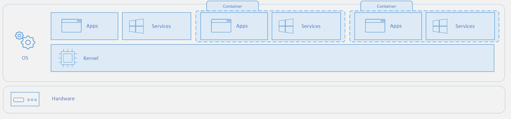

# Comparativa de servicios de Compute

Servicio | Descripción
-------- | -----------
Azure Kubernetes Services (AKS) | **Servicio de orquestación**. Es decir, administra y y automatiza una gran cantidad de contenedores y se encarga de la interacción entre ellos.
Azure Virtual Machine (VM) | Pueden ser usados cuando careces de servidores fisicos. Consideralo una computadora dentro de otra computadora que esta a tu control casi total
Azure Functions | **Serverless o informática sin servidor**. Con las functions, Azure se encarga de de la infraestructura, la asignación de recursos de acuerdo a la demada y del rendimiento. Tu solo te preocupas por el código que se ejecuta ahí.
Azure Logic Apps | Al igual que Azure Functions, puede ejecutar automatizaciones por eventos pero aquí no se crean con código de programación sino con una interfaz gráfica 
Azure App Service | Servicio que permite crear y hospedar aplicaciones web, trabajos en segundo plano, back-ends móviles y API RESTful en el lenguaje de programación que prefieras, sin tener que preocuparte por la infraestructura.
Azure Container Instances (ACI) | Un contenedor es un **entorno de virtualización**. Sin embargo, a diferencia de las VM, aquí no operas todo el sistema operativo. Los contenedores son ligeros y están diseñados para crearse, escalarse horizontalmente y detenerse de forma dinámica. 

## Azure Virtual Machine
Con Azure Virtual Machines, puede crear y utilizar máquinas virtuales en la nube. Estas máquinas virtuales proporcionan una infraestructura como servicio (IaaS) en forma de un servidor virtualizado y se pueden usar de muchas formas. Al igual que sucede en un equipo físico, se puede personalizar todo el software que se ejecuta en la máquina virtual. Las máquinas virtuales son una opción ideal cuando se necesita lo siguiente:
- Control total sobre el sistema operativo (SO).
- Capacidad de ejecutar software personalizado.
- Usar configuraciones de hospedaje personalizadas.

La maquina virtual es toda la computadora completa pero sin el hardware.

Ahora probablemente te preguntarás **¿Cuando es mejor usar las maquinas virtuales sobre los contenedores?** Claro que dependerá de tu solución y de la finalidad de la herramienta pero aquí tienes cuatro casos en los que sería mejor usar maquinas virtuales:

- Alojar cargas de trabajo tradicionales, monolíticas y heredadas
- Aislar ciclos de desarrollo riesgosos
- Implementar recursos de infraestructura (como redes, servidores y datos)
- Ejecutar un sistema operativo diferente dentro de otro sistema operativo (por ejemplo, ejecutar Unix en Linux)

### Composición de una VM

Puedes usarlas para:
- Extender las capacidades de un centro de datos on-premise o de otras maquinas virtuales
- Para hacer pruebas durante el desarrollo
- Para recuperación de desastres
- Para ejecutar aplicaciones de nube
- Aislar una solución
- Para ejecutar Windows o Linux y usar programas que tu computadora no pueda ejecutar

### Azure Virtual Machine Scale Sets
Se pueden agrupar las máquinas virtuales para proporcionar alta disponibilidad, escalabilidad y redundancia. Con independencia de cuáles sean los requisitos de tiempo de actividad, Azure cuenta con varias características para que pueda cumplirlos.

**Los Scale Sets permiten crear y administrar un grupo de máquinas virtuales idénticas, de carga equilibrada.**

Con ellos puedes administrar, configurar y actualizar de forma centralizada un gran número de máquinas virtuales en cuestión de minutos para proporcionar aplicaciones altamente disponibles.

### Azure Batch
Azure Batch **permite trabajo por lotes paralelos a gran escala y de informática de alto rendimiento** (HPC) con la capacidad de escalar a decenas, cientos o miles de máquinas virtuales.

Batch:

- Iniciará automáticamente un grupo de máquinas virtuales
- Instalará aplicaciones y datos de almacenamiento provisional
- Ejecutará las tareas que se le indiquen
- Identificará errores
- Reordenará la cola de trabajo
- Reducirá verticalmente el grupo a medida que se complete el trabajo

## Azure Kubernetes Services
**Kubernetes** es una plataforma de código abierto portable y extensible para la administración y orquestación de cargas de trabajo en contenedores.

Conviene usar Kubernetes cuando:
- Desarrolles aplicaciones como microservicios
- Desarrolles aplicaciones como aplicaciones nativas de nube
- Implementes microservicios mediante contenedores
- Actualices contenedores a escala
- Requieras funciones centralizadas de administración de almacenamiento y redes de contenedores

[Video sobre como funcionan Kubernetes](https://youtu.be/oTf0KxK1QNo?t=55)

## Azure Container Instances
El termino de **contenedores** viene desde la industría de la logistica y el transporte y son son espacios fisicos donde aislas el cargamento. Usualmente son de metal.

Un contenedor es un paquete de software estándar que  agrupa el código de una aplicación con las bibliotecas y los archivos de configuración asociados, junto con las dependencias necesarias para que la aplicación se ejecute. Esto permite a los desarrolladores y profesionales de TI implementar aplicaciones sin problemas en todos los entornos.

Así te evitas el clasico problema de "Es que en mi maquina si funcionaba".

Un contenedor replica este entorno de ejecución para hacerlo identico en diferentes instancias de si mismo o en diferentes sistemas operativos sin necesidad de alterar el sistema operativo.

En Azure tenemos Azure Container Instancies que es un servicio PaaS para crear y administrar contenedores sin tener que administrar ninguna máquina virtual o adoptar ningún servicio adicional.

Los contenedores se pueden usar cuando:

Caso de uso | Explicación
------------ | -----------
Aplicaciones nativas de la nube | Las aplicaciones nativas de la nube se basan en contenedores para lograr un entorno de operación común entre entornos, incluidos los públicos, privados e híbridos.
Machine Learning | Los contenedores pueden hacer que las aplicaciones de Machine Learning sean autónomas y se puedan escalar fácilmente en cualquier entorno.
Procesamiento por lotes o Batch | Como generación de informes,  cambio de tamaño de imágenes y conversión de archivos de un formato a otro. Los contenedores proporcionan una manera fácil de ejecutar trabajos por lotes sin tener que administrar un entorno y las dependencias.

Ahora probablemente te preguntarás **¿Cuando es mejor usar contenedores sobre las VM?** Claro que dependerá de tu solución y de la finalidad de la herramienta pero aquí tienes cuatro casos en los que sería mejor usar contenedores:

- Diseñar aplicaciones nativas de la nube
- Empaquetar microservicios
- Implantar gradualmente las prácticas de DevOps o de integración/distribución continuas CI/CD
- Trasladar proyectos de TI escalables a todo un footprint de TI diverso con el - mismo sistema operativo

### Composición de un contenedor

## Azure Functions 

Azure Functions es una solución sin servidor o *serverless* que te permite escribir menos código, mantener menos infraestructura y ahorrar costos. En lugar de preocuparte por implementar, mantener servidores, instalar las herramientas de desarrollo, implementar el sistema operativo, etc. la nube proporciona todos los recursos actualizados necesarios para mantener las aplicaciones en ejecución.

Con Azure Functions solo pagas por el tiempo en el que se ejecuta tu código. 

A menudo, se crean sistemas para que reaccionen a una serie de eventos críticos, es decir, que cuando se genera una petición, se realiza una acción o se llega a determinada hora y/o fecha se ejecuta el bloque de código de Azuer Functions.

Azure Functions es normalmente usado en los siguientes escenarios:

Si deseas... | Entonces...
------------ | -----------
Crear una API web | Implementa un punto de conexión para las aplicaciones web mediante el [desencadenador HTTP](https://docs.microsoft.com/es-es/azure/azure-functions/functions-bindings-http-webhook)
Procesar cargas de archivos | Ejecuta código cuando se cargue o se cambie un archivo en el almacenamiento de blobs (Blog Storage)
Compilar un flujo de trabajo serverless | Encadena una serie de funciones mediante [Durable Functions](https://docs.microsoft.com/es-es/azure/azure-functions/durable/durable-functions-overview?tabs=csharp)
Responder a cambios en una base de datos | Ejecuta código personalizado cuando se cree o actualice un documento en Cosmos DB
Ejecutar tareas programadas | Ejecuta código a horas establecidas
Crear sistemas de cola de mensajes confiables | Procesa colas de mensajes mediante Queue Storage, Service Bus o Event Hubs
Analizar flujos de datos de IoT	| Recopile y procese datos de [dispositivos IoT](https://docs.microsoft.com/es-es/azure/azure-functions/functions-bindings-event-iot)
Procesar datos en tiempo real | Use [Functions y SignalR](https://docs.microsoft.com/es-es/azure/azure-functions/functions-bindings-signalr-service) para responder a los datos en el momento.

### Azure Logic Apps
Es un servicio en la nube que te ayuda a programar, automatizar y organizar tareas, procesos empresariales y flujos de trabajo cuando tiene que integrar aplicaciones, datos, sistemas y servicios en empresas u organizaciones.

Al igual que Azure Functions, posibilita las cargas de trabajo sin servidor (*serverless*). Sin embargo, **Azure Functions es un servicio de proceso sin servidor, mientras que Azure Logic Apps proporciona flujos de trabajo sin servidor**

En Azure Functions, las orquestaciones se desarrollan mediante la escritura de código y el uso de la extensión [Durable Functions](https://docs.microsoft.com/es-es/azure/azure-functions/durable/durable-functions-overview?tabs=csharp). En Logic Apps, las orquestaciones se crean mediante una Interfaz de usuario o editando archivos de configuración.
