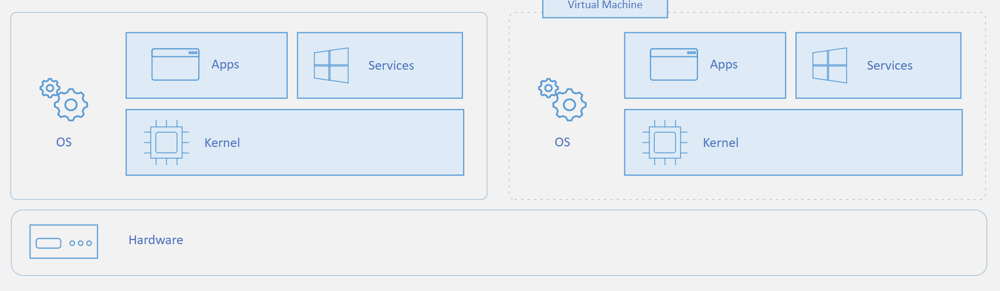

# Comparativa de servicios de Compute

Servicio | Descripción
-------- | -----------
Azure Kubernetes Services (AKS) | **Servicio de orquestación**. Es decir, administra y y automatiza una gran cantidad de contenedores y se encarga de la interacción entre ellos.
Azure Virtual Machine (VM) | Pueden ser usados cuando careces de servidores fisicos. Consideralo una computadora dentro de otra computadora que esta a tu control casi total
Azure Functions | **Serverless o informática sin servidor**. Con las functions, Azure se encarga de de la infraestructura, la asignación de recursos de acuerdo a la demada y del rendimiento. Tu solo te preocupas por el código que se ejecuta ahí.
Azure App Service | Servicio que permite crear y hospedar aplicaciones web, trabajos en segundo plano, back-ends móviles y API RESTful en el lenguaje de programación que prefieras, sin tener que preocuparte por la infraestructura.
Azure Container Instances (ACI) | Un contenedor es un **entorno de virtualización**. Sin embargo, a diferencia de las VM, aquí no operas todo el Sistema operativo. Los contenedores son ligeros y están diseñados para crearse, escalarse horizontalmente y detenerse de forma dinámica. 

## Azure Virtual Machine
Con Azure Virtual Machines, puede crear y utilizar máquinas virtuales en la nube. Estas máquinas virtuales proporcionan una infraestructura como servicio (IaaS) en forma de un servidor virtualizado y se pueden usar de muchas formas. Al igual que sucede en un equipo físico, se puede personalizar todo el software que se ejecuta en la máquina virtual. Las máquinas virtuales son una opción ideal cuando se necesita lo siguiente:
- Control total sobre el sistema operativo (SO).
- Capacidad de ejecutar software personalizado.
- Usar configuraciones de hospedaje personalizadas.

La maquina virtual es toda la computadora completa pero sin el hardware.

### Composición de una VM

Puedes usarlas para:
- Extender las capacidades de un centro de datos on-premise o de otras maquinas virtuales
- Para hacer pruebas durante el desarrollo
- Para recuperación de desastres
- Para ejecutar aplicaciones de nube
- Aislar una solución

### Azure Virtual Machine Scale Sets
Se pueden agrupar las máquinas virtuales para proporcionar alta disponibilidad, escalabilidad y redundancia. Con independencia de cuáles sean los requisitos de tiempo de actividad, Azure cuenta con varias características para que pueda cumplirlos.

Los Scale Sets permiten crear y administrar un grupo de máquinas virtuales idénticas, de carga equilibrada.

Con ellos puedes administrar, configurar y actualizar de forma centralizada un gran número de máquinas virtuales en cuestión de minutos para proporcionar aplicaciones altamente disponibles.

### Azure Batch
Azure Batch permite trabajo por lotes paralelos a gran escala y de informática de alto rendimiento (HPC) con la capacidad de escalar a decenas, cientos o miles de máquinas virtuales.

Batch:

- Iniciará automáticamente un grupo de máquinas virtuales
- Instalará aplicaciones y datos de almacenamiento provisional
- Ejecutará las tareas que se le indiquen
- Identificará errores
- Reordenará la cola de trabajo
- Reducirá verticalmente el grupo a medida que se complete el trabajo

## Azure Kubernetes Services
**Kubernetes** es una plataforma de código abierto portable y extensible para la administración y orquestación de cargas de trabajo en contenedores.

Conviene usar Kubernetes cuando:
- Desarrolles aplicaciones como microservicios
- Desarrolles aplicaciones como aplicaciones nativas de nube
- Implementes microservicios mediante contenedores
- Actualices contenedores a escala
- Requieras funciones centralizadas de administración de almacenamiento y redes de contenedores

## Azure Functions 

### Azure Logic Apps

## Azure Container Instances

