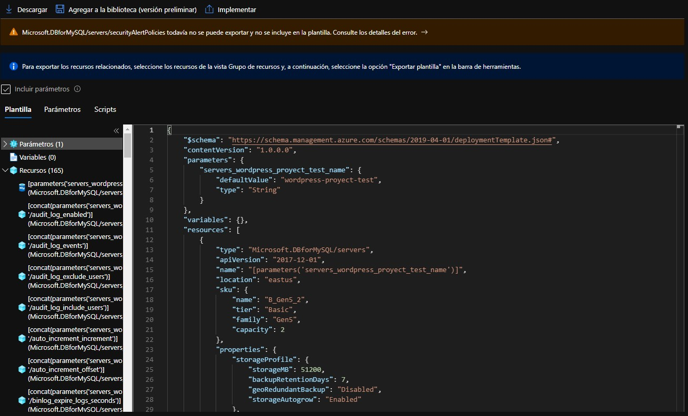

# ¿Cómo hacer una plantilla de Azure Resouce Manager (ARM)

- [**Indice**](#)
  - [Crea tu plantilla](#crea-tu-plantilla)
  - [Obtener una plantilla de ARM ya hecha]()
    - [Opción 1: Descargarla de un recurso existente en Azure Portal](#opción-1-descargarla-de-un-recurso-existente-en-azure-portal)
    - [Opción 2: Descargar la plantilla de todo un grupo de recursos](#opción-2-descargar-la-plantilla-de-todo-un-grupo-de-recursos)
    - [Opción 3: Obtenerla de la comunidad](#opción-3-obtenerla-de-la-comunidad)

:book: **Plantilla de Azure Resource Manager (ARM)**:  es un archivo de notación de objetos JavaScript (JSON) que contiene la infraestructura y la configuración del proyecto. En la plantilla se especifican los recursos que se van a implementar y las propiedades de esos recursos.

## Crea tu plantilla

Puedes obtener una plantilla de ARM o puedes crearla tu para hacer tus propias configuraciones de recursos de Azure.

1. Abre cualquier editor de código o IDE. Te recomiendo Visual Studio Code e instalar la extensión [Azure Resource Manager (ARM) Tools](https://marketplace.visualstudio.com/items?itemName=msazurermtools.azurerm-vscode-tools)
2. Crea un archivo llamado `azuredeploy.json`
3. Copia y pega lo siguiente que es la base de la plantilla
```JSON
{
  "$schema": "https://schema.management.azure.com/schemas/2019-04-01/deploymentTemplate.json#",
  "contentVersion": "1.0.0.0",
  "resources": []
}
```

- `$schema`: Especifica la ubicación del archivo de esquema JSON. El archivo de esquema describe las propiedades que están disponibles dentro de una plantilla
- `contentVersion`: Especifica la versión de la plantilla (por ejemplo, 1.0.0.0)
- `resources`: Contiene los recursos que desea implementar o actualizar. Actualmente está vacía, pero agregará recursos más adelante

4. Ejecuta el comando en el [CLI de Azure ](https://docs.microsoft.com/es-es/cli/azure/install-azure-cli) suplantando las palabras en mayúsculas por la información que corresponde a tu caso.
```
az deployment group create \
  --name NOMBRE_PLANTILLA \
  --resource-group NOMBRE_GRUPO_RECURSOS \
  --template-file DIRECCION_ARCHIVO_PLANTILLA
```
**Tip**: Posicionate en la misma carpeta que en la que eesta el archivo json.

**Nota**: En el Azure CLI de Windows cambia las diagonales **\\** Por el simbolo de potencia **^** (no aplica para PowerShell).

Si te aparece lo siguiente quiere decir que la plantilla fue implementada con éxito:
```
"ProvisioningState": "Succeeded",
```

5. Ve a portal.azure.com y dirigete a tu grupo de recursos. Después da clic en Implementaciones o *Deplyments*


6. Aquí encontrarás la plantilla que acabas de crear junto con todas las implementaciones que se han hecho desde Azure Portal, Cloud Shell o Azure CLI


Si el nombre de tu plantilla aparece como correcta quiere decir que se implementó bien. Dentro ya puedes tener más información de su ejecución

7. Ahora vamos a agregar un recurso a tu plantilla. Modificala de tal forma que quede así:
```JSON
{
  "$schema": "https://schema.management.azure.com/schemas/2019-04-01/deploymentTemplate.json#",
  "contentVersion": "1.0.0.0",
  "resources": [
    {
      "type": "Microsoft.Storage/storageAccounts",
      "apiVersion": "2019-04-01",
      "name": "NOMBRE_RECURSO",
      "location": "eastus",
      "sku": {
        "name": "Standard_LRS"
      },
      "kind": "StorageV2",
      "properties": {
        "supportsHttpsTrafficOnly": true
      }
    }
  ]
}
```
**Cambia las letras en mayúsculas por el nombre de recurso que desees.**

Aquí estamos creando una cuenta de almacenamiento, que entre sus tantas funciones, te permite usar Azure Cloud Shell. 

**Nota**: el nombre de la cuenta de almacenamiento de Azure solo admite de 3 a 24 caracteres de letras mayúsculas o minúsculas y números. No caracteres especiales, espacios o guiones.

Cada recurso implementado tiene al menos las siguientes tres propiedades:

- `type`: tipo de recurso. Este valor es una combinación del espacio de nombres del proveedor de recursos y el tipo de recurso, como `Microsoft.Storage/storageAccounts`
- `apiVersion`: Versión de la API de REST que debe usar para crear el recurso. Cada proveedor de recursos publica sus propias versiones de API, por lo que este valor es específico del tipo
- `name`: Nombre del recurso

Adicionalmente se agregaron otros campos como:

- `location`: región de Azure en la que se implementará el recurso
- `sku`: nivel de producto o servicio con el que se creará, en este caos Standard.
- `kind`: tipo de almacenamidnto usado para el recurso. Este recurso puede no usarse para todos los casos.
- `properties`: Se establecen propiedades especificas para este recurso. En este caso se le impone al recurso el solo permitir solicitudes HTTPS de salida y entrada.

8. Ejecuta los pasos 4, 5 y 6 de nuevo. 

**Ahora, la plantilla que tenemos le vamos a agregar un parametro.**

9. Vas a agregar lo siguiente en la plantilla. Esto debe estar en el primer nivel, es decir, al mismo nivel que `contentVersion`


```JSON
"parameters": {
    "storageName": {
      "type": "string",
      "minLength": 3,
      "maxLength": 24
    }
  },
```

Dentro de `resources` debes agregar lo siguiente:
```JSON
"name": "[parameters('storageName')]",
```

De tal forma que el código completo de la plantilla sea el siguiente:

```JSON
{
  "$schema": "https://schema.management.azure.com/schemas/2019-04-01/deploymentTemplate.json#",
  "contentVersion": "1.0.0.0",
  "parameters": {
    "storageName": {
      "type": "string",
      "minLength": 3,
      "maxLength": 24
    }
  },
  "resources": [
    {
      "type": "Microsoft.Storage/storageAccounts",
      "apiVersion": "2019-04-01",
      "name": "[parameters('storageName')]",
      "location": "eastus",
      "sku": {
        "name": "Standard_LRS"
      },
      "kind": "StorageV2",
      "properties": {
        "supportsHttpsTrafficOnly": true
      }
    }
  ]
}
```

El parametro que estamos definiendo se llama `storageName` y es un *string* o cadena de caracteres que se ingresa la momento de invocar el template con Azure CLI.

Este parametro permite ser usado a lo largo de toda la plantilla y podríamos poner un SKU común para todos los recursos, un nombre similar, la localización o cualquier cosa que queramos y sea compatible con el recurso y con la sintaxis de las plantillas.

10. Para ejecutar este nueva plantilla necesitas ejecutar el siguiente comando sustituyendo los valores en las palabras en mayusculas:


```
az deployment group create \
  --name NOMBRE_PLANTILLA \
  --resource-group NOMBRE_GRUPO_RECURSOS \
  --template-file DIRECCION_ARCHIVO_PLANTILLA \
  --parameters storageName=VALOR_storageName
```

**Nota**: Lo que pongas en vez de VALOR_storageName será el valor que tenga esta variable dentro de toda la plantilla. Estos parametros se pueden considerar como constantes en un lenguaje de programación.

**Y así como podemos poner parametros o constantes, también podemos colocar variables**

11. Agregarás a tu plantilla lo siguiente:

```JSON
"storagePrefix": {
      "type": "string",
      "minLength": 3,
      "maxLength": 11
    },

"variables": {
    "uniqueStorageName": "[concat(parameters('storagePrefix'), uniqueString(resourceGroup().id))]"
  },

"name": "[variables('uniqueStorageName')]",

```

Dando como resultado lo siguiente:

```JSON
{
  "$schema": "https://schema.management.azure.com/schemas/2019-04-01/deploymentTemplate.json#",
  "contentVersion": "1.0.0.0",
  "parameters": {
    "storagePrefix": {
      "type": "string",
      "minLength": 3,
      "maxLength": 11
    }
  },
  "variables": {
    "uniqueStorageName": "[concat(parameters('storagePrefix'), uniqueString(resourceGroup().id))]"
  },
  "resources": [
    {
      "type": "Microsoft.Storage/storageAccounts",
      "apiVersion": "2019-04-01",
      "name": "[variables('uniqueStorageName')]",
      "location": "eastus",
      "sku": {
        "name": "Standard_LRS"
      },
      "kind": "StorageV2",
      "properties": {
        "supportsHttpsTrafficOnly": true
      }
    }
  ]
}
```

En la sección variables se une el valor que introduces en el CLI como storagePrefix con un *string* aleatorio, esto con el fin de evitar que se repitan los nombres en los mismos recursos y pueda derivar en un error de implementación.

12. Ejecutas la plantilla de ARM con el siguiente comando de Azure CLI

```
az deployment group create \
  --name NOMBRE_PLANTILLA \
  --resource-group NOMBRE_GRUPO_RECURSOS \
  --template-file DIRECCION_ARCHIVO_PLANTILLA \
  --parameters storagePrefix=VALOR_storagePrefix
```

Después de la ejecución exitosa de este comando te debe de crear un recurso similar a este:


Si quieres aprender más sobre la creación de las plantillas consulta la siguiente documentación:
- [Documentación de las plantillas de Resource Manager
](https://docs.microsoft.com/es-mx/azure/azure-resource-manager/templates/)
- [Buenas practicas para plantillas ARM](https://github.com/Azure/azure-quickstart-templates/blob/master/)

## Obtener una plantilla de ARM ya hecha

### Opción 1: Descargarla de un recurso existente en Azure Portal

1. Dirigete a portal.azure.com
2. Una vez dentro, explora el detalle de un recurso haciendo clic desde la página principal o desde la sección **Todos los recursos**
3. Una vez dentro del recurso, desliza el menu lateral izquierdo hasta el fondo y encontrarás la opción **Exportar plantilla**


4. Encontrarás una interfaz similar a esta:



Dentro de esta interfaz podrás:

- **Descargar** la plantilla que resultará en dos archivos JSON editablesque contienen:
  - La o las plantillas
  - Los parametros usados en todas las plantillas. Por ejemplo, una dirección de serivdor, una dirección IP o un grupo de recursos único
- **Implementar** la plantilla para hacer una replica del recurso en el que te encuentras
- **Guardar en la biblioteca**. Donde podrás encontrar las plantillas que más uses o que necesites para después.

**Nota**: No puedes editar una plantilla desde el Azure Portal, para ello tendrías que descargarlas. Además, puedes bajarla o implementarla con o sin los parametros.

### Opción 2: Descargar la plantilla de todo un grupo de recursos

1. Dirigete a portal.azure.com
2. Una vez dentro, explora el detalle de un recurso haciendo clic desde la página principal o desde la sección **Todos los recursos**. Si no te aparece este botón, puedes buscarlo utilizando la barra de busqueda superior.
3. Selecciona un grupo de recursos
4. Una vez dentro del grupo de recursos, desliza el menu lateral izquierdo hasta el fondo y encontrarás la opción **Exportar plantilla**
5. Las opciones son las mismas que al descargar la plantilla de un solo recurso solo con la diferencia que aquí exportas la implementación de todos los recursos dentro del grupo.

### Opción 3: Obtenerla de la comunidad

Estas plantillas son creadas por personas de la comunidad de Azure de todo el mundo y todas están validadas para su uso.

1. Ve al repositorio de [Quickstart Templates](https://github.com/Azure/azure-quickstart-templates)
2. Escoge una plantilla y al hacer clic en ella te aparecerá la siguiente interfaz:


Donde puedes:

- Ver el código JSON de la plantilla en el archivo `azuredeploy.json`
- Implementarla en tu cuenta de Azure con un solo clic desde el botón Deploy to Azure. Esto te abrirá una ventana de portal.azure.com con todas las configuraciones de la plantilla donde tu puedes modificar los parametros y ordenar la ejecución manualmente
- Implementarla en un ambiente de Azure Gov si esta se encuentra validada para ello
- Ver las pruebas que ha pasado por medio de *badges*
- Verla en un diagrama similar a este:


